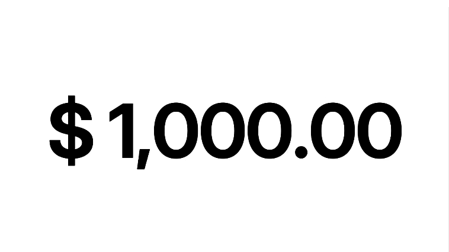

# react-spinning-number 🎉

Welcome to `react-spinning-number`! If you're tired of boring static numbers in your react app, then get ready to spin things up—literally! This package adds some serious ✨ pizzazz ✨ to your numbers with smooth, eye-catching animations.

## Features

- 🧩 **Universal Format Support:** Handles strings in any format — whether it's time, date, prices, or anything else.
- 🪶 **Less than 0kb:** It's so lightweight, it might just disappear! (But it won't, we promise.)
- 🛡️ **Zero Dependencies:** No baggage, no problems. Just pure spinning goodness.
- 🦴 **Headless:** You bring the style, react-spinning-number brings the spin.
- 🎨 **Cool Animation:** Transform your digits into mesmerizing spinners.

## Usage

To get started, just install `react-spinning-number` via your favorite package manager:

```bash
npm install react-spinning-number
yarn add react-spinning-number
pnpm add react-spinning-number
bun add react-spinning-number
```

Want to see those numbers spin?

```javascript
import React, { useState } from "react";
import SpinningNumber from "react-spinning-number";

export default function Component() {
  const [value, setValue] = useState(1);

  return (
    <div>
      <SpinningNumber>{value}</SpinningNumber>
      <button onClick={() => setValue(value + 1)}>Increase</button>
    </div>
  );
}
```

## Configuration

There props are allowed for the `SpinningNumber` component:

| Property    | Required | Type               | Default | Description                                                                                     |
| ----------- | -------- | ------------------ | ------- | ----------------------------------------------------------------------------------------------- |
| `children`  | ✅       | `string \| number` | -       | The number or string to spin.                                                                   |
| `fontSize`  | ✅       | `number`           | -       | Sets the font size for the spinning numbers.                                                    |
| `className` | ❌       | `string`           | -       | Adds a custom class for additional styling.                                                     |
| `style`     | ❌       | `CSSProperties`    | -       | Custom inline styles, excluding `lineHeight`, `fontSize`, `margin`, `whiteSpace` and `padding`. |
| `duration`  | ❌       | `number`           | `300`   | Controls the duration of the each digits spin animation, in milliseconds.                       |
| `stagger`   | ❌       | `number`           | `100`   | Adds a stagger effect to the spin animation, in milliseconds.                                   |

## Credits

This project was inspired by the [react-native-spinning-numbers](https://github.com/birdwingo/react-native-spinning-numbers) library by [birdwingo](https://github.com/birdwingo). A big thanks to them for their work, which served as a great inspiration for this project.
